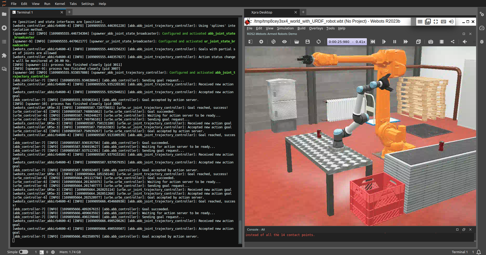
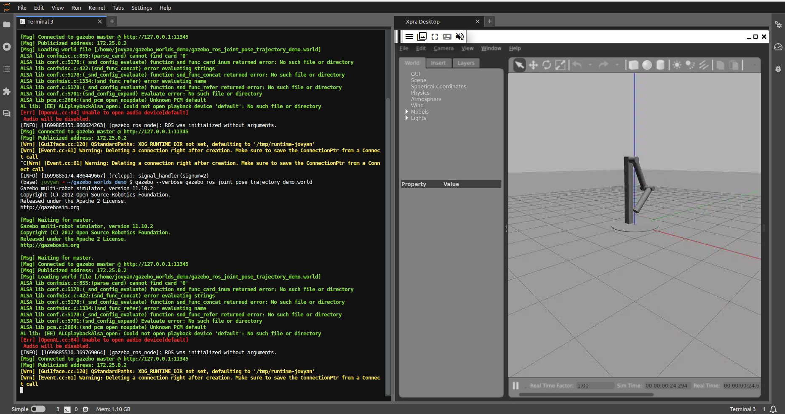

# ROS2 in JupyterLab docker image

[](https://hub.docker.com/r/intel4coro/jupyter-ros2/tags)
[](https://binder.intel4coro.de/v2/gh/IntEL4CoRo/jupyter-ros2.git/HEAD)

This is a template repository to build ROS2 applications capable to run on BinderHub/Docker. The default installed distribution is [jazzy Hawksbill](https://docs.ros.org/en/jazzy/index.html), which is a long-term support (LTS) release that will be supported until May 2029. To install a newer or development [distribution](https://docs.ros.org/en/jazzy/Releases.html), change the variable `$ROS_DISTRO` in [Dockerfile](./Dockerfile).

You can use this repository to do following (and more):

- Learn the [ROS2 tutorials](https://docs.ros.org/en/jazzy/Tutorials.html) without installing anything.
- Quickly start a ROS2 environment in a local Docker container regardless of your operating system.
- Starting to migrate projects from ROS1 to ROS2.
- Create live demos for your ROS2 applications.

## Quick Start

### Get started with ROS2 tutorials

- Try [ROS2 jazzy tutorials](https://docs.ros.org/en/jazzy/Tutorials.html) on BinderHub: [](https://binder.intel4coro.de/v2/gh/IntEL4CoRo/jupyter-ros2/HEAD?labpath=tutorials%2FTurtlesim.ipynb)

- Start the "VNC Desktop" in the JupyterLab Launcher to initiate the virtual display before you run GUI applications.
- Open new launchers tab to start terminals.
- Arrange tabs by dragging.
- Most of the installation steps in the tutorials can be skipped.


### Start a ROS2 environment locally

To connect to real robots or run computate intense robot simulators, you need to run docker container on your local machine.
A ready-to-run docker image `intel4coro/jupyter-ros2:jazzy-py3.12` is pushed to [DockerHub](https://hub.docker.com/r/intel4coro/jupyter-ros2/tags).

#### Prerequisites

- [Docker Engine](https://docs.docker.com/engine/install/)
- [Ubuntu](https://releases.ubuntu.com/) (Tested with Ubuntu 20.04)
- Nvidia Graphic Card and [NVIDIA Container Toolkit](https://docs.nvidia.com/datacenter/cloud-native/container-toolkit/latest/install-guide.html) (Optional but recommended)

#### Start Docker container

```bash
docker run --rm -p 8888:8888 intel4coro/jupyter-ros2:jazzy-py3.12 jupyter lab --NotebookApp.token=''
```

Open url http://localhost:8888/

#### Start Docker container with GPU enabled

```bash
xhost +local:docker && \
docker run --rm -p 8888:8888 \
-v /tmp/.X11-unix:/tmp/.X11-unix:rw \
--env DISPLAY=$DISPLAY \
--env NVIDIA_DRIVER_CAPABILITIES=all \
--gpus all intel4coro/jupyter-ros2:jazzy-py3.12 && \
xhost -local:docker
```

Recommended to start with docker-compose if having many custom configurations Example: [docker-compose.yml](./docker-compose.yml).

## Create your ROS2 application live demo

You can start a ROS2 project from scratch with this template repository, or create your own ROS2 environment by extending the image `intel4coro/jupyter-ros2:jazzy-py3.12`, all you need is to create a `Dockerfile` under the root path or directory `binder/` in your git repository. Extending the pre-built image can save a huge amount of time from installing software dependencies.

### Dockerfile Example

```Dockerfile
FROM intel4coro/jupyter-ros2:jazzy-py3.12

# Run bash commands required root permission
USER root
RUN apt update && apt install nano vim
USER ${NB_USER}

# Define environment variables
ENV ROS_WS=/home/${NB_USER}/my_ros2_ws

# Create your ROS workspace
RUN mkdir -p ${ROS_WS}/src
# Change working directory (similar to command "cd")
WORKDIR ${ROS_WS}
# Copy files from your git repo to ROS workspace
COPY --chown=${NB_USER}:users src src/my-repo-name

# Install ROS packages dependencies
USER root
RUN rosdep update && apt update && \
    rosdep install --from-paths src --ignore-src -r -y && \
    rosdep fix-permissions

# Build ROS workspace
USER ${NB_USER}
RUN colcon build --parallel-workers 4
# Source ROS workspace in new bash terminals
RUN echo "source ${ROS_WS}/install/setup.bash" >> /home/${NB_USER}/.bashrc

# Override the entrypoint to add startup scripts
# Note: Do not forget to add `exec "$@"` at the end of your entrypoint.
COPY --chown=${NB_USER}:users entrypoint.sh /
ENTRYPOINT ["/entrypoint.sh"]
```

## Software components

- [ros-jazzy-desktop](https://docs.ros.org/en/jazzy/index.html): Desktop install of ROS2 jazzy with RViz, demos, tutorials.
- [Jupyterlab](https://github.com/jupyterlab/jupyterlab): Web-based integrated development environment (IDE)
- [VNC Remote Desktop](https://github.com/jupyterhub/jupyter-remote-desktop-proxy): Run XFCE (or other desktop environments) on Jupyter.
- [Webots ROS2 Interface](https://github.com/cyberbotics/webots_ros2): Package that provides the necessary interfaces to simulate a robot in the [Webots](https://cyberbotics.com/) Open-source 3D robots simulator.
- ~~[Gazebo Classic](http://classic.gazebosim.org/): Classic Robotic Simulator~~

## Development

Update the [Dockerfile](./Dockerfile) to make further changes to the docker image, for example, changing the ROS distribution or removing packages that you don't need. The config of running the docker image on your machine locally is specify in [docker-compose.yml](./docker-compose.yml).

### Checkout git submodules

```bash
git submodule update --init
```

### Run Image Locally (Under repo directory)

- Run Docker image

  ```bash
  docker compose up
  ```

- Open url http://localhost:8888/

- Force image rebuild after updating the [Dockerfile](./Dockerfile)

  ```bash
  docker compose up -d --build 
  ```

#### Enable nvidia GPU and display GUI applications on host machine

To display GUI applications on your host machine instead of a virtual display.
Uncomment the following configs in [docker-compose.yml](./docker-compose.yml)

```docker-compose
    #   - /tmp/.X11-unix:/tmp/.X11-unix:rw
    # environment:
    #   - DISPLAY
    #   - NVIDIA_DRIVER_CAPABILITIES=all
    # deploy:
    #   resources:
    #     reservations:
    #       devices:
    #         - driver: nvidia
    #           count: all
    #           capabilities: [gpu]
```

and run `docker compose up` with X-forwarding:

```bash
xhost +local:docker && \
docker compose up && \
xhost -local:docker
```

## Simulators

[Webots](https://cyberbotics.com/) and [Gazebo](https://gazebosim.org/home) are two advanced robot simulators mentioned in the ROS2 tutorials.

### Webots

> Note: Webots is super graphically demanding simulator, better running it with GPU enabled.

- Launch Multirobot Example:

  ```base
  ros2 launch webots_ros2_universal_robot multirobot_launch.py
  ```

- Type "Y" to install Webots on the first run.



See [Webots - ROS2 documenation](https://docs.ros.org/en/jazzy/Tutorials/Advanced/Simulators/Webots/Setting-Up-Simulation-Webots-Basic.html) for more details and github repo [cyberbotics/webots_ros2](https://github.com/cyberbotics/webots_ros2/wiki/Examples) for more examples.

<!-- ### Gazebo classic

>Note: Gazebo classic no longer available on `ROS2 jazzy`.

Copy Gazebo world demos to directory `gazebo_worlds_demo`

```base
cp -R /opt/ros/${ROS_DISTRO}/share/gazebo_plugins/worlds /home/${NB_USER}/gazebo_worlds_demo
```

Explaination of these demos can be found at the beginning of the `*.world` files.

Open a new terminal under directory `gazebo_worlds_demo` and launch demos:

```bash
gazebo --verbose gazebo_ros_joint_pose_trajectory_demo.world
```

 -->

## Troubleshooting

1. JupyterLab instance crashed when running `colcon build`
  
    Limit the number of building threads like this: `colcon build --parallel-workers 2`

## License

Copyright 2023 IntEL4CoRo\<forcoro@uni-bremen.de\>

This repository is released under the Apache License 2.0, see [LICENSE](./LICENSE).  
Unless attributed otherwise, everything in this repository is under the Apache License 2.0.

### Acknowledgements

This Docker image is based on [jupyter/docker-stacks](https://github.com/jupyter/docker-stacks), licensed under the [BSD License](https://github.com/jupyter/docker-stacks/blob/main/LICENSE.md).

Gazebo example referneces [Tiryoh/docker-ros2-desktop-vnc](https://github.com/Tiryoh/docker-ros2-desktop-vnc), licensed under the [Apache License 2.0](https://github.com/Tiryoh/docker-ros2-desktop-vnc/blob/master/LICENSE).
