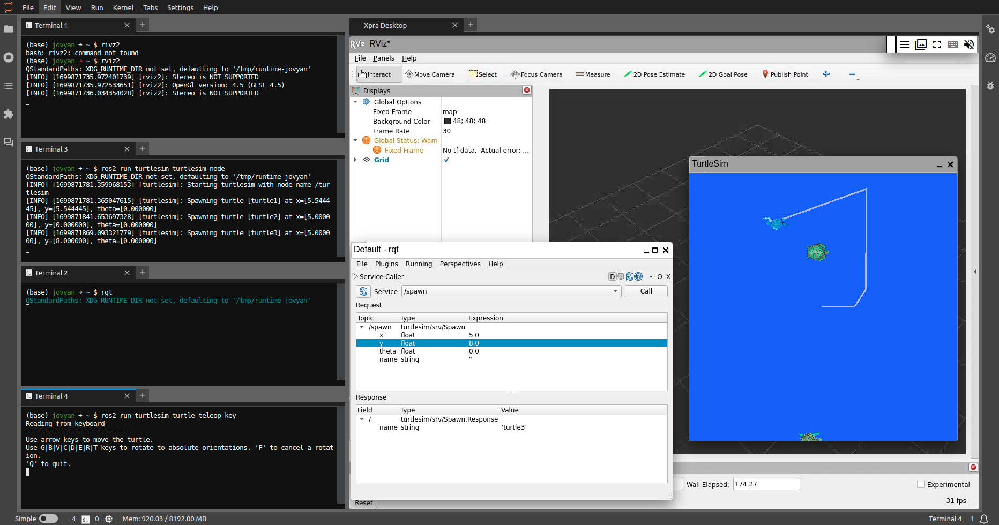

# ROS2 Humble in JupyterLab docker image

[](https://hub.docker.com/r/intel4coro/jupyter-ros2/tags)
[](https://binder.intel4coro.de/v2/gh/IntEL4CoRo/jupyter-ros2.git/HEAD)

This is a template repository to build ROS2 docker image capable to run on BinderHub. To install a different distribution of ROS2, change the variable `$ROS_DISTRO` in [Dockerfile](./Dockerfile) to another [ROS distribution](https://docs.ros.org/en/humble/Releases.html).

Image `intel4coro/jupyter-ros2:humble-py3.10` is a ready-to-run image built on top of jupyter image [jupyter/minimal-notebook:python-3.10](https://jupyter-docker-stacks.readthedocs.io/en/latest/using/selecting.html#jupyter-minimal-notebook) , contains the following main softwares:

- [ros-humble-desktop](https://docs.ros.org/en/humble/index.html): Desktop install of ROS2 humble with RViz, demos, tutorials.
- [Jupyterlab](https://github.com/jupyterlab/jupyterlab): Web-based integrated development environment (IDE)
- [XPRA Remote Desktop](https://github.com/Xpra-org/xpra): Virtual Display to project native GUI applications on web browser.
- [Webots ROS2 Interface](https://github.com/cyberbotics/webots_ros2): Package that provides the necessary interfaces to simulate a robot in the [Webots](https://cyberbotics.com/) Open-source 3D robots simulator.
- [Gazebo Classic](http://classic.gazebosim.org/): Classic Robotic Simulator



## Quick Start

### Option1: On BinderHub

An easy way to start the [ROS2 Humble tutorials](https://docs.ros.org/en/humble/Tutorials.html) is via our Binderhub services: [](https://binder.intel4coro.de/v2/gh/IntEL4CoRo/jupyter-ros2.git/HEAD)

Most of the installation steps in the tutorials can be skipped.

>Note: Please start the "Xpra Desktop" in the JupyterLab Launcher to initiate the virtual display before you run GUI applications.

### Option2: On Local Machine

The docker image can also run on your local machines when you need to connected to real robots and run intensive robot simulators.

#### Prerequisites

- [Docker Engine](https://docs.docker.com/engine/install/)
- [Ubuntu](https://releases.ubuntu.com/) (Only tested with Ubuntu 20.04)
- Nvidia Graphic Card and [NVIDIA Container Toolkit](https://docs.nvidia.com/datacenter/cloud-native/container-toolkit/latest/install-guide.html) (Optional but recommended)

#### Start Docker container

```bash
docker run --rm -p 8888:8888 intel4coro/jupyter-ros2:humble-py3.10 jupyter lab --NotebookApp.token=''
```

Open url http://localhost:8888/

#### Start Docker container with GPU enabled

```bash
xhost +local:docker && \
docker run --rm -p 8888:8888 \
-v /tmp/.X11-unix:/tmp/.X11-unix:rw \
--env DISPLAY=$DISPLAY \
--env NVIDIA_DRIVER_CAPABILITIES=all \
--gpus all intel4coro/jupyter-ros2:humble-py3.10 && \
xhost -local:docker
```

Recommended to start with docker-compose if having many custom configurations Example: [docker-compose.yml](./docker-compose.yml).

## Create ROS2 environment for existing project

You can start a ROS2 project from scratch with this template repository, or build your own ROS2 environment based on this image, all you need is to create a `Dockerfile` under the root path or directory `binder/` in your git repository. Extending the image `intel4coro/jupyter-ros2:humble-py3.10` instead of modifying the it can save a huge amount of time from installing software dependencies.

### Dockerfile Example

```Dockerfile
FROM intel4coro/jupyter-ros2:humble-py3.10

# Run bash commands required root permission
USER root
RUN apt update && apt install nano vim
USER ${NB_USER}

# Define environment variables
ENV MY_ROS_WS=/home/${NB_USER}/my-ros-workspace

# Create your ROS workspace
RUN mkdir -p ${MY_ROS_WS}/src
# Change working directory (similar to command "cd")
WORKDIR ${MY_ROS_WS}
# Copy files from git repo to ROS workspace
COPY --chown=${NB_USER}:users . src/my-repo-name
# Install ROS packages dependencies
RUN rosdep install -i --from-path src --rosdistro ${ROS_DISTRO} -y
# Build ROS workspace
RUN colcon build

# Override the entrypoint to add startup scripts, (e.g., source your ROS workspace)
# Note: Do not forget to add `exec "$@"` at the end of your entrypoint.
COPY --chown=${NB_USER}:users entrypoint.sh /
ENTRYPOINT ["/entrypoint.sh"]
```

## Development

The config of running the docker image on your machine locally is specify in [docker-compose.yml](./docker-compose.yml).

> Note: The configs in [docker-compose.yml](./docker-compose.yml) will not take effect in the Binderhub.

### Run Image Locally (Under repo directory)

- Run Docker image

  ```bash
  docker compose up
  ```

- Open url http://localhost:8888/

- Force image rebuild after updating the [Dockerfile](./Dockerfile)

  ```bash
  docker compose up -d --build 
  ```

#### Enable nvidia GPU and display GUI applications on host machine

To display GUI applications on your host machine instead of a Xpra virtual display.
Uncomment the following configs in [docker-compose.yml](./docker-compose.yml)

```docker-compose
    #   - /tmp/.X11-unix:/tmp/.X11-unix:rw
    # environment:
    #   - DISPLAY
    #   - NVIDIA_DRIVER_CAPABILITIES=all
    # deploy:
    #   resources:
    #     reservations:
    #       devices:
    #         - driver: nvidia
    #           count: all
    #           capabilities: [gpu]
```

and run `docker compose up` with X-forwarding:

```bash
xhost +local:docker && \
docker compose up && \
xhost -local:docker
```

## Simulators

### Webots

> Note: Webots is super performance intensive, better to run it with GPU enabled.

- Launch Multirobot Example:

  ```base
  ros2 launch webots_ros2_universal_robot multirobot_launch.py
  ```

- Type "Y" to install Webots on the first run.


See [Webots - ROS2 documenation](https://docs.ros.org/en/humble/Tutorials/Advanced/Simulators/Webots/Setting-Up-Simulation-Webots-Basic.html) for more details and github repo [cyberbotics/webots_ros2](https://github.com/cyberbotics/webots_ros2/wiki/Examples) for more examples.

### Gazebo classic

>Note: Gazebo classic doesn't work on our BinderHub server, will try new Gazebo releases in the future.

Copy demos to directory `gazebo_worlds_demo`

```base
cp -R /opt/ros/${ROS_DISTRO}/share/gazebo_plugins/worlds /home/jovyan/gazebo_worlds_demo
```

Explaination of these demos can be found at the beginning of the `*.world` files.

Open a new terminal under directory `gazebo_worlds_demo` and launch demos:

```bash
gazebo --verbose gazebo_ros_joint_pose_trajectory_demo.world
```


## Troubleshooting

1. JupyterLab instance crashed when running `colcon build`
  
    Limit the number of building threads like this: `colcon build --parallel-workers 2`

## License

Copyright 2023 IntEL4CoRo\<intel4coro@uni-bremen.de\>

This repository is released under the Apache License 2.0, see [LICENSE](./LICENSE).  
Unless attributed otherwise, everything in this repository is under the Apache License 2.0.

### Acknowledgements

This Docker image is based on [jupyter/docker-stacks](https://github.com/jupyter/docker-stacks), licensed under the [BSD License](https://github.com/jupyter/docker-stacks/blob/main/LICENSE.md).

Gazebo example referneces [Tiryoh/docker-ros2-desktop-vnc](https://github.com/Tiryoh/docker-ros2-desktop-vnc), licensed under the [Apache License 2.0](https://github.com/Tiryoh/docker-ros2-desktop-vnc/blob/master/LICENSE).
